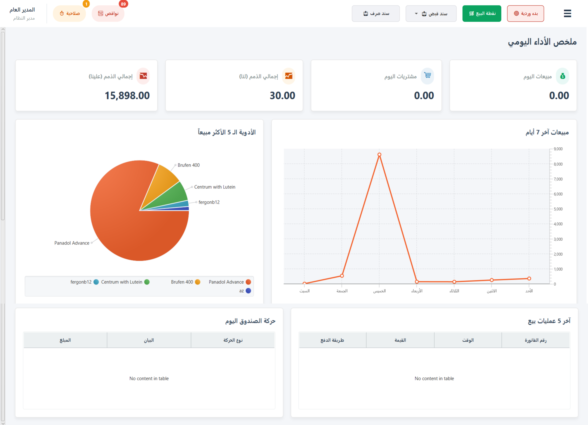
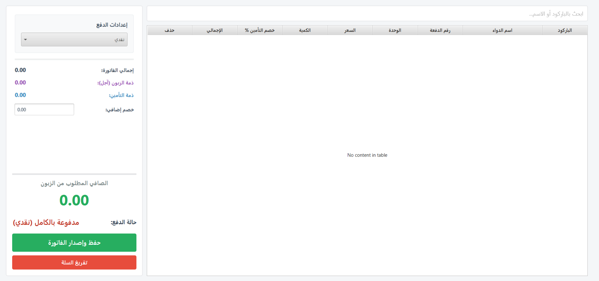
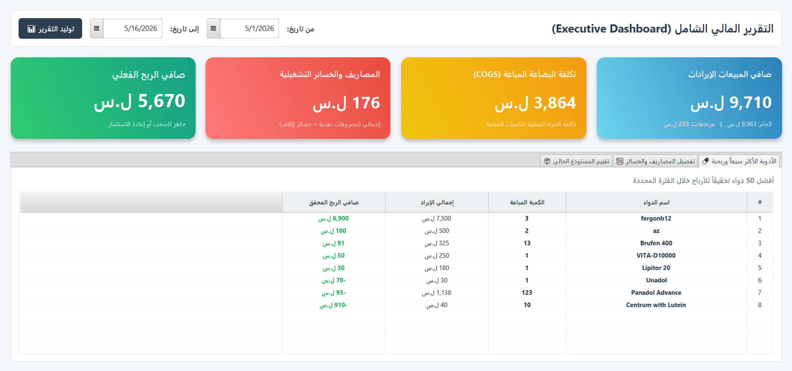
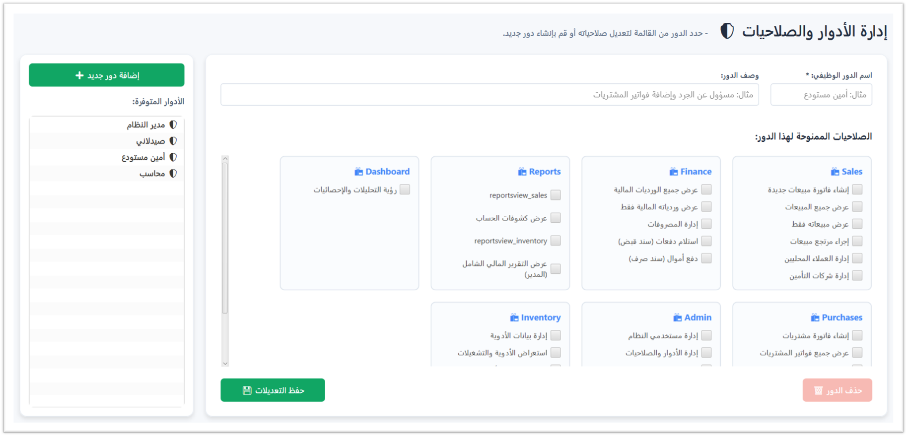

# 💊 Pharmacy Management ERP System

نظام متكامل لتخطيط موارد المؤسسات (ERP) مخصص لإدارة الصيدليات، تم تصميمه وهندسته ليحاكي متطلبات بيئة العمل التجارية المعقدة. تم بناء هذا النظام كمشروع تخرج متكامل في كلية الهندسة المعلوماتية (جامعة الاتحاد الخاصة)، ويعكس تطبيقاً دقيقاً لمفاهيم هندسة البرمجيات، أمان البيانات، وتصميم واجهات المستخدم الحديثة.

---

## 📸 واجهات النظام
| الشاشة الرئيسية



| شاشة البيع



| شاشة التقرير المالي للصيدلية



| شاشة الادوار والصلاحيات



---

## ✨ الميزات الهندسية والوظيفية الشاملة

تم تصميم قاعدة بيانات النظام والمحرك البرمجي لمعالجة أدق تفاصيل العمل الصيدلاني، وتشمل الميزات التالية:

### 1. 🛡️ الأمان، الرقابة، وإدارة الورديات (Security & Shifts)
* **نظام الصلاحيات الديناميكي (Role-Based Access):** تخصيص دقيق للصلاحيات (مدير، صيدلاني، محاسب) للتحكم بالوصول إلى وحدات النظام.
* **إدارة الورديات المالية (Shift Management):** ربط صارم لكل العمليات (بيع، شراء، مصاريف، مرتجعات) بوردية الموظف المفتوحة، مع تتبع رصيد الافتتاح، الرصيد المتوقع، والرصيد الفعلي عند الإغلاق لمنع التلاعب.
* **سجل الرقابة الآلي (Audit Logs):** مراقبة صامتة مبنية على مستوى قاعدة البيانات (Triggers) تسجل أي تعديلات حساسة (مثل تغيير أسعار الأدوية أو إيقاف تفعيلها) مع توثيق القيمة القديمة والجديدة وتاريخ التعديل.

### 2. 📦 محرك المخزون والكتالوج (Inventory Engine)
* **إدارة التشغيلات (Batches & Expiry):** تتبع دقيق للأدوية بناءً على أرقام التشغيل، وتواريخ الإنتاج والانتهاء.
* **معامل التحويل الذكي (Conversion Factor):** معالجة برمجية سلسة تتيح الشراء بالعلبة (Box) والبيع بالوحدة المجزأة (Unit/ظرف/حبة) مع ضبط الأسعار والكميات تلقائياً.
* **البدائل الدوائية (Drug Alternatives):** نظام ربط شبكي يقترح الأدوية البديلة للمريض في حال نفاذ الصنف المطلوب.
* **تنبيهات مؤتمتة (Automated Alerts):** استعلامات مدمجة (Views) لاكتشاف الأدوية منتهية الصلاحية (خلال 90 يوماً) أو النواقص التي تجاوزت الحد الأدنى للمخزون.

### 3. 💳 المبيعات، الزبائن، والتأمين الصحي (POS & Insurance)
* **الفصل المحاسبي للتأمين:** قدرة متقدمة في نقطة البيع على فصل الفاتورة تلقائياً إلى (حصة المريض النقدي) و (حصة شركة التأمين الآجلة)، مع تسجيل رمز الموافقة الطبية.
* **إدارة الديون (Debts):** تتبع دقيق لذمم الزبائن المحليين وشركات التأمين، مع نظام لتسجيل الدفعات اللاحقة.
* **معالجة المرتجعات (Returns):** نظام استرداد يحسب المبالغ النقدية المعادة للمريض ويلغي مطالبات التأمين بدقة.

### 4. 🛒 الموردون والمشتريات (Suppliers & Purchases)
* **إدارة فواتير الموردين:** تسجيل المشتريات، إدارة البونص (الكميات المجانية)، وتتبع التكاليف.
* **دورة الدفع والاسترداد:** تسجيل دفعات الموردين، وإدارة المرتجعات أو التوالف مع حساب تعويضات الموردين أو خسائر الصيدلية.
* **التسويات الجردية (Inventory Adjustments):** تسجيل الفروقات بين الجرد النظامي والجرد الفعلي وتوثيق الملاحظات.

---

## 🛠️ البنية التقنية (Tech Stack)
* **Backend:** Java (JDK 11+)
* **Frontend:** JavaFX (UI/UX)
* **Database:** SQLite (Embedded & Independent)
* **Database Driver:** `sqlite-jdbc`

---

## 🚀 دليل التحميل والتشغيل للمهندسين والطلاب

هذا المشروع مستقل تماماً (Standalone). عند التشغيل الأول، يقوم المحرك البرمجي بإنشاء ملف قاعدة البيانات (`*.db`) وتهيئة كافة الجداول، الفهارس (Indexes)، والمشغلات (Triggers) تلقائياً، مما يلغي الحاجة لأي سكربتات إعداد خارجية.

### 📥 1. استنساخ المشروع (Cloning)
افتح موجه الأوامر (Terminal) ونفذ:
```bash
git clone [https://github.com/Mohammed-Ayad-Alhajji/Pharmacy-ERP-System.git](https://github.com/Mohammed-Ayad-Alhajji/Pharmacy-ERP-System.git)
```

⚙️ 2. إعداد بيئة التطوير (IDE Setup - IntelliJ / Eclipse)
نظراً لاعتماد المشروع على واجهات JavaFX وقاعدة بيانات مضمنة، يرجى اتباع الخطوات الهندسية التالية:

قم بفتح المشروع في بيئة التطوير الخاصة بك.

ربط مكتبة قاعدة البيانات: تأكد من إضافة ملف sqlite-jdbc.jar إلى مسار البناء (Build Path / Libraries) الخاص بالمشروع.

إعداد JavaFX: * قم بتحميل JavaFX SDK المطابق لنسخة الـ JDK لديك.

أضف مكتبات JavaFX إلى (Global Libraries).

خطوة هامة: في إعدادات التشغيل (Run/Debug Configurations)، أضف السطر التالي إلى حقل VM Options (مع تعديل المسار لمسار JavaFX لديك):
```
Plaintext
--module-path "C:\path\to\javafx-sdk\lib" --add-modules javafx.controls,javafx.fxml
```
▶️ 3. التشغيل (Running)
قم بتنفيذ الفئة الرئيسية Main.java.

سيقوم النظام بالتحقق من وجود قاعدة البيانات؛ إن لم تكن موجودة، سيتم بناؤها فوراً وسيتم توجيهك لشاشة تسجيل الدخول الأولى "اسم المستحدم admin وكلمة السر admin123".

تم التطوير بواسطة: محمد أياد الحاجي
